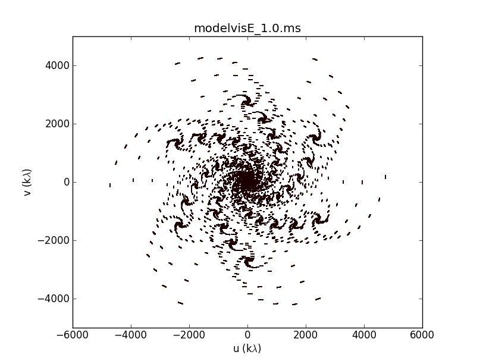

# SOS: SKA Observation Simulator

It simulates SKA1_Mid visibility (radio observation) for a given radio sky. Simulator uses python and CASA-toolkit
for simulation. It needs to be run within CASA and at the moment is compatible with CASA version 4.7.2 or earlier.
CASA compatible SKA1_Mid configuration file is provided here which contains coordinates of the telescope that we knew were
part of SKA1_Mid until mid 2017. 

  
   
  <em>Figure: UV coverage from 15 min of simulated observation out of SKA1_Mid.</em>

SOS contains
--------------

1. make_img.py : It makes a toy-model radio sky based on the inputs provided.
	
2. SOS.py : It simulates SKA visibility when a radio sky and SKA configuration file is provided.

3. ska_mid197.cfg : configuration file containing antenna details of SKA1_Mid. List of 197 antennas (including MeerKAT).

4. ska_mid133.cfg : configuration file containing antenna details of SKA1_Mid. List of 133 antennas (excluding MeerKAT).

5. ska_uv.png : sample uv coverage of SKA (15-min observation) for the inputs used in SOS.py file.

6. SOSv2.py : It simulates SKA visibility when a radio sky and SKA configuration file is provided in CASA versions > 4.7.2.

7. ska_mid197_new.cfg : New configuration file (for CASA 4.7.2+) containing antenna details of SKA1_Mid. List of 197 antennas (including MeerKAT).

4. ska_mid133_new.cfg : New configuration file (for CASA 4.7.2+) containing antenna details of SKA1_Mid. List of 133 antennas (excluding MeerKAT).

*SOS works in CASA 4.7.2 or earlier.*
--------------------------------------
*SOSv2.py which uses config file named as '*_new.cfg' runs in CASA versions > 4.7.2 *
--------------------------------------

Using instructions:
-------------------
1) Run the script within CASA via -- execfile('script_name')
2) Make sure SKA configuration file is in the same folder where your SOS script is.

Authors of SOS:
----------------

Deepak Deo and Dr. Ruta Kale

